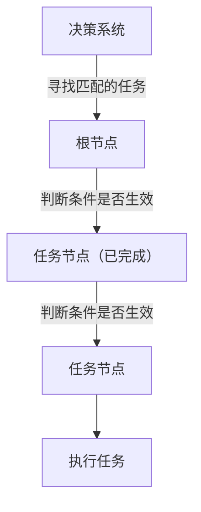

# RobDecision-EditWeb

## 快速开始

决策流程图的本质原理是 依据条件是否成立跳转到 匹配的任务。

metricType (统计类型维度)

1: 当前数值

2: 累计增量

3: 累计减量

4: 历史存在

temporalScope (时间范围维度)

类型：type

1: 全周期

2: 任务周期

3: 滚动周期

参数：rollingWindow（当类型为滚动周期时）

格式为时间 单位 秒