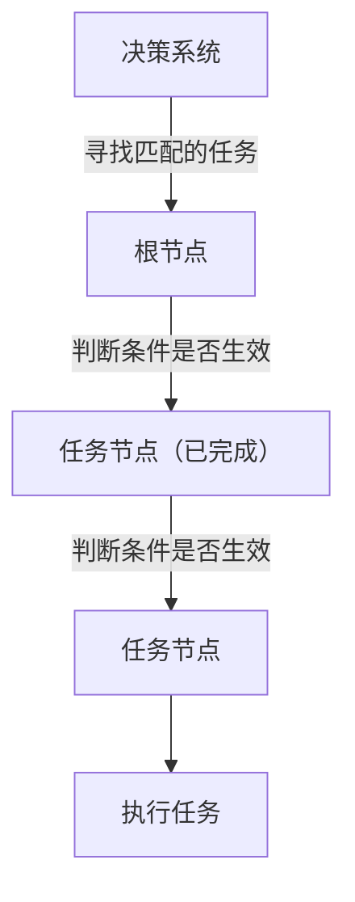
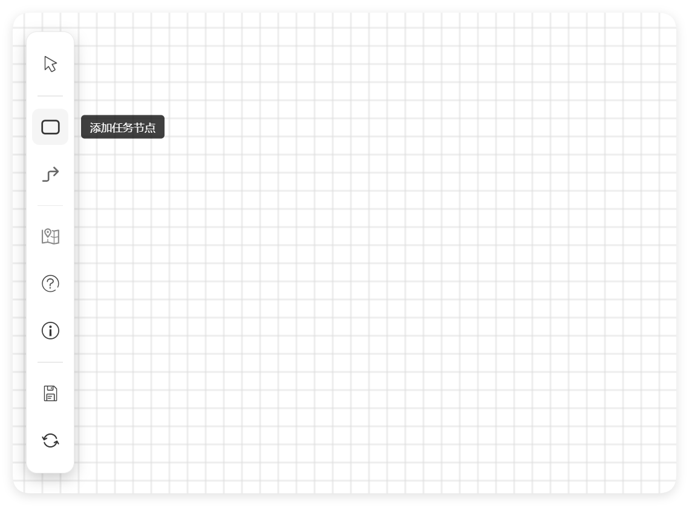
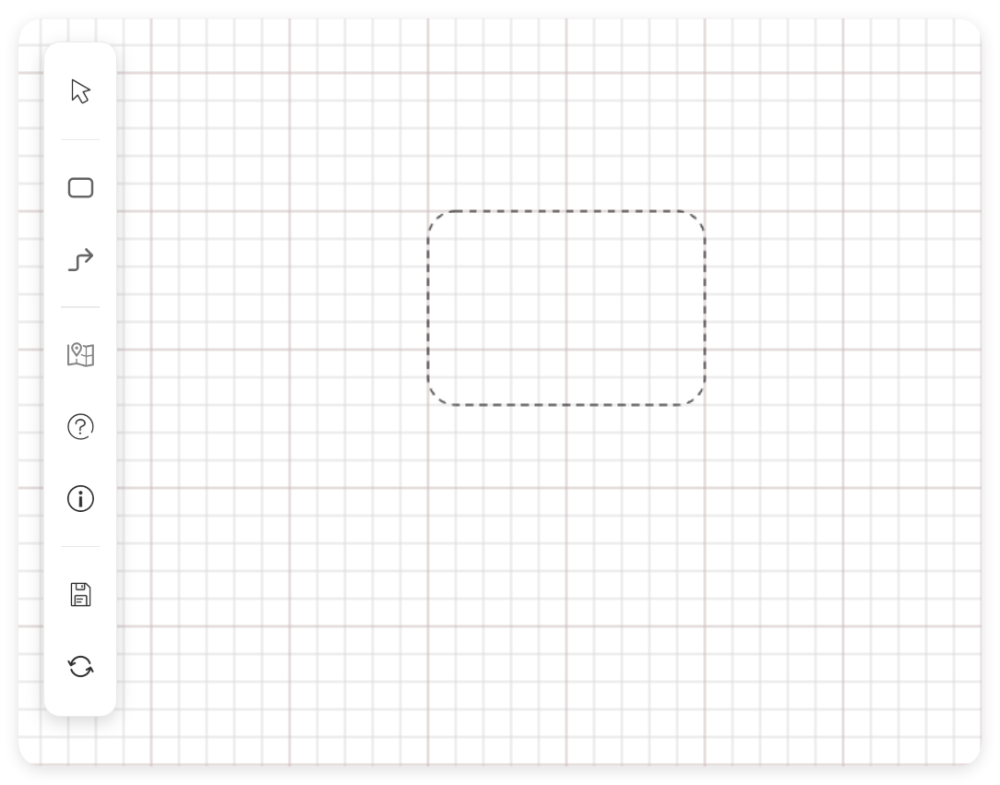
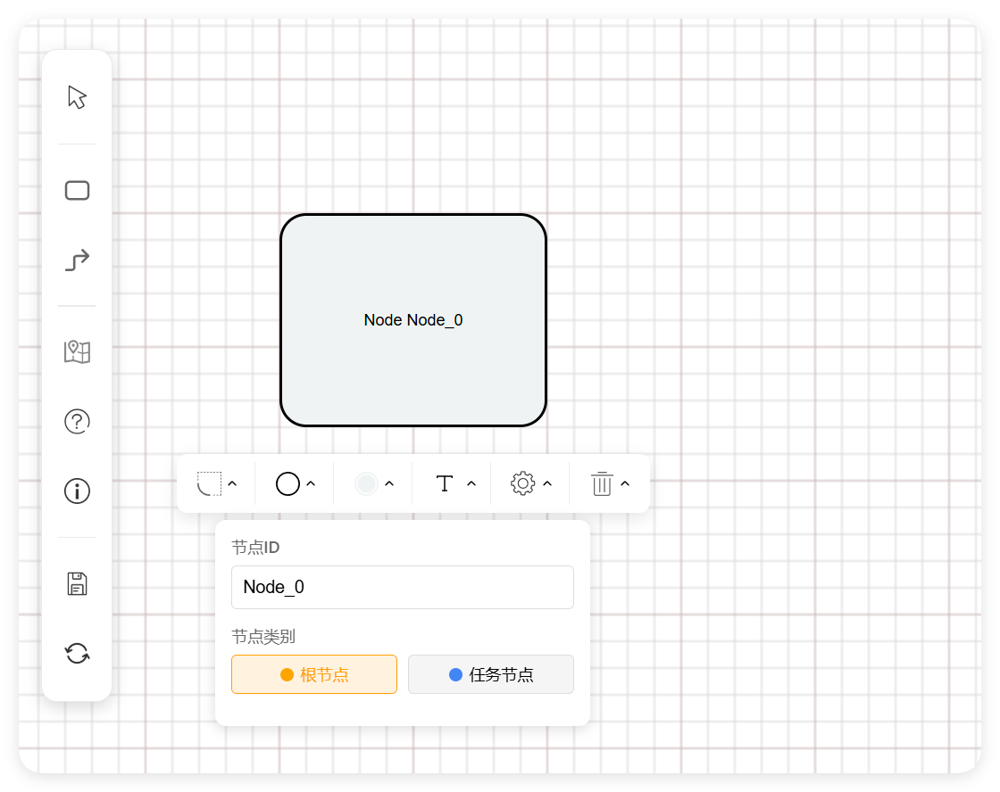
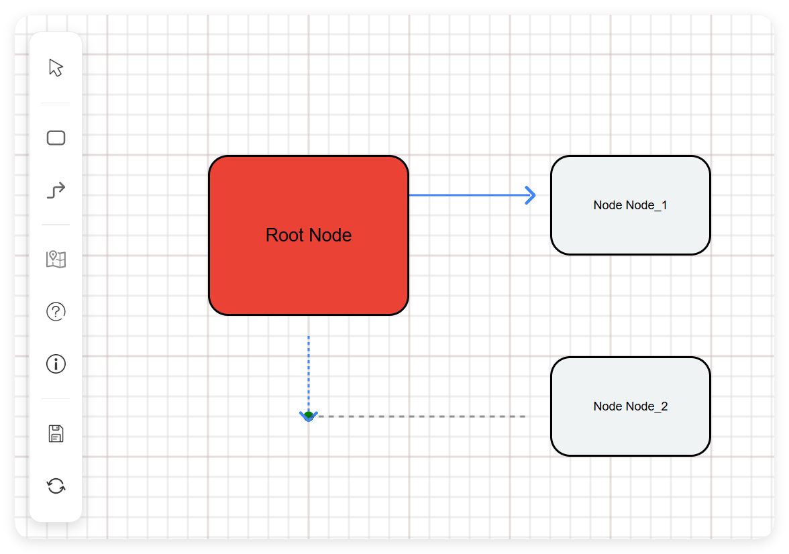
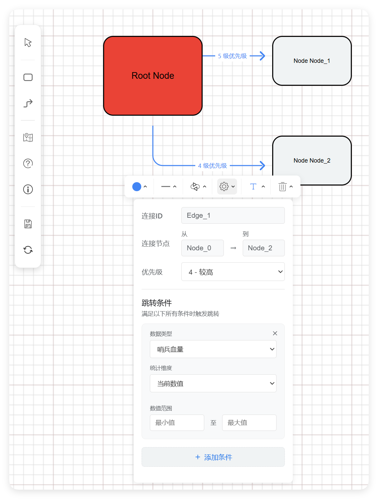
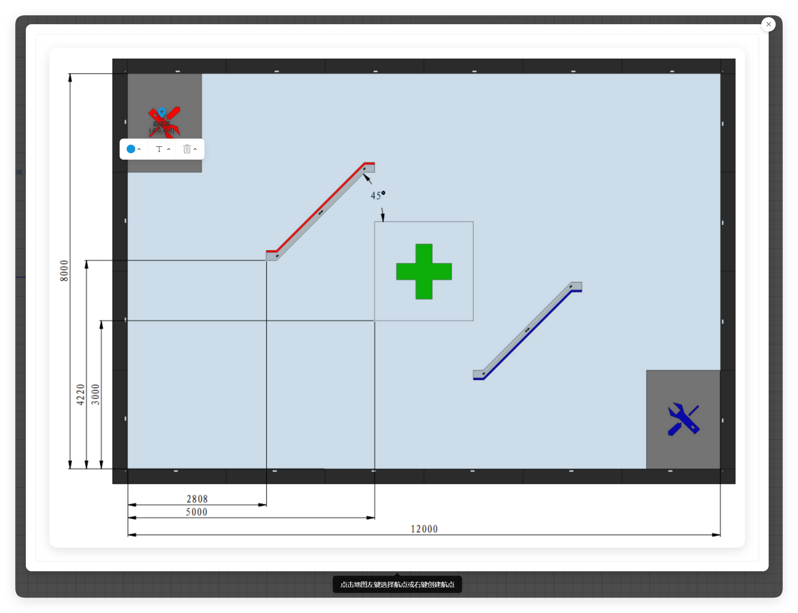
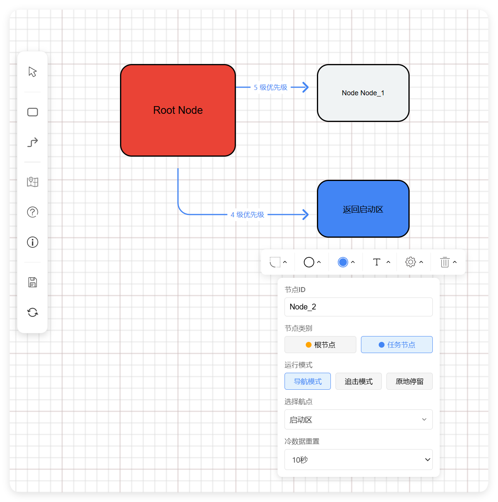

# RobDecision-EditWeb

## 说明

决策流程图的本质原理是 *依据条件是否成立来跳转到*  匹配的任务。

### 跳转条件说明

具体数据类型的值所对应的情况，详见裁判系统串口协议附录

#### 跳转说明:

只有导航任务完成后才会尝试跳转，如果任务为追击，等待。则满足条件后立即跳转到下一节点

#### 任务重置:

每一次跳转到任务节点都会重新赋值 “**上次访问时间**”。

一段时间内未被跳转到的节点会重置完成状态。

在节点设置中为 **冷数据重置** 选项

#### 统计类型维度

1: 当前数值    顾名思义，判断最新的数值

2: 累计增量    统计时间维度设置中数值的累计增加量，比如：统计比赛开始后一共兑换多少发弹量

3: 累计减量    统计时间维度设置中数值的累计增加量，比如：统计比赛开始后一共消耗多少发弹量

4: 历史存在    统计时间维度设置中数值是否出现过，比如:  是否最近 10s 内是否检测到敌方机器人

#### 时间范围维度

1: 全周期   统计比赛开始后的所有数据

2: 任务周期  统计执行任务开始至今的所有数据

3: 滚动周期  统计最近一段时间范围内的所有数据

## 快速开始

### 创建一个节点

从创建一个根节点开始:

### 创建任务链

创建多个节点后，我们可以使用 “添加连接线” 使用 连接线 将 两个节点连接起来.
我们可以在 连接线 的菜单中设置 跳转条件 和 优先级

### 设置任务

设置导航任务前，我们需要设置航点。可以通过地图添加航点

